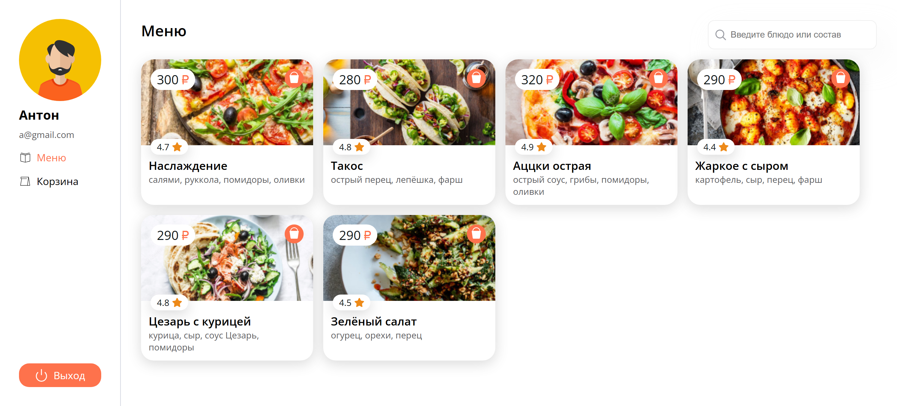

# Pizza Project

A pizza ordering application built with Vite, React, and TypeScript.

## Technologies

- **React**
- **TypeScript**
- **SCSS**
- **Axios**
- **React-DOM**
- **React Hook Form**
- **React-Redux**
- **React Router DOM**
- **Yup**
- **Vite**

## Architecture

```
src/
├── components/             # Reusable UI components
│   ├── Box/               # Box component for layout purposes
│   ├── Button/            # Button component with styles
│   ├── Card/              # Card component for displaying grouped content
│   ├── CartItem/          # Component for individual cart items
│   ├── Header/            # Header component for navigation
│   ├── Input/             # Input fields with validation
│   ├── Loader/            # Loading spinner component
│   ├── Price/             # Component for displaying prices
│   ├── Rating/            # Component for showing ratings
│   └── Search/            # Search bar component
│
├── helpers/                # Utility functions and constants
│   ├── api.ts             # API configuration and requests
│   ├── constants.ts       # Application-wide constants
│   └── requireAuth.tsx    # Higher-order component for route protection
│
├── layout/                 # Layout components
│   ├── AuthLayout/        # Layout for authentication pages
│   ├── Layout/            # Main layout for the application
│   └── LeftMenu/          # Sidebar menu layout
│
├── pages/                  # Application pages
│   ├── Cart/              # Cart page for managing orders
│   ├── ErrorPage/         # Error page for handling 404 or other errors
│   ├── Login/             # Login page with form validation
│   ├── Menu/              # Menu page displaying available products
│   ├── Product/           # Product details page
│   ├── Register/          # Registration page with form validation
│   └── SuccessOrder/      # Page displayed after successful order placement
│
├── store/                  # State management using Redux Toolkit
│   ├── cart.slice.ts      # Slice for managing cart state
│   ├── user.slice.ts      # Slice for managing user state
│   ├── storage.ts         # Utility for local storage interactions
│   └── store.ts           # Redux store configuration
│
├── types/                  # TypeScript types and interfaces
│   ├── cart.ts            # Types for cart-related data
│   ├── products.ts        # Types for product-related data
│   └── user.ts            # Types for user-related data
│
└── main.tsx                # Application entry point
```

## Development

```bash
# Install dependencies
yarn install

# Start development server
yarn dev

# Build the project
yarn build

# Run linter
yarn lint

# Run prettier
yarn lint
```

## Login Parameters

- **Credentials**:
  - **Login 1**: `a@gmail.com`
    - **Password**: `123`
  - **Login 2**: `tesvov@gmail.com`
    - **Password**: `1234`

## Preview


